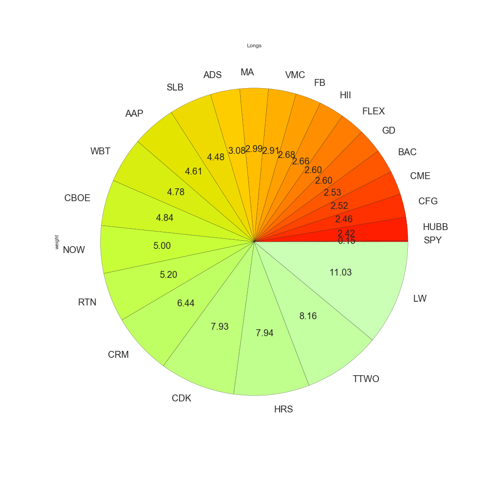
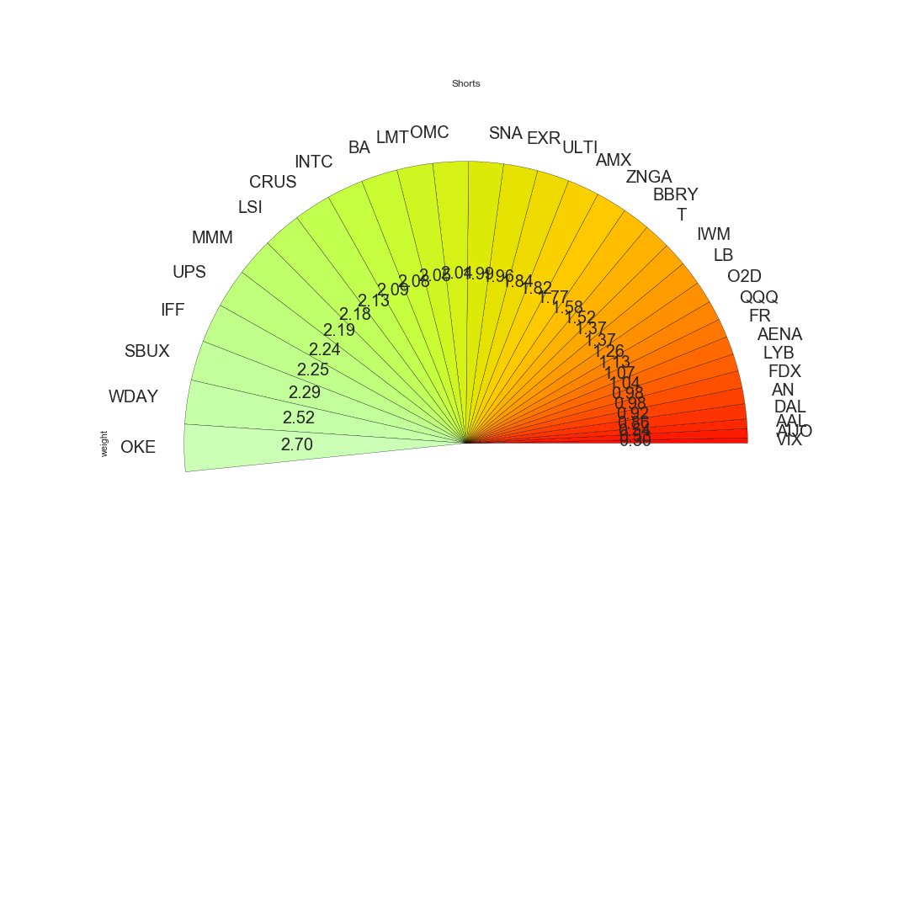
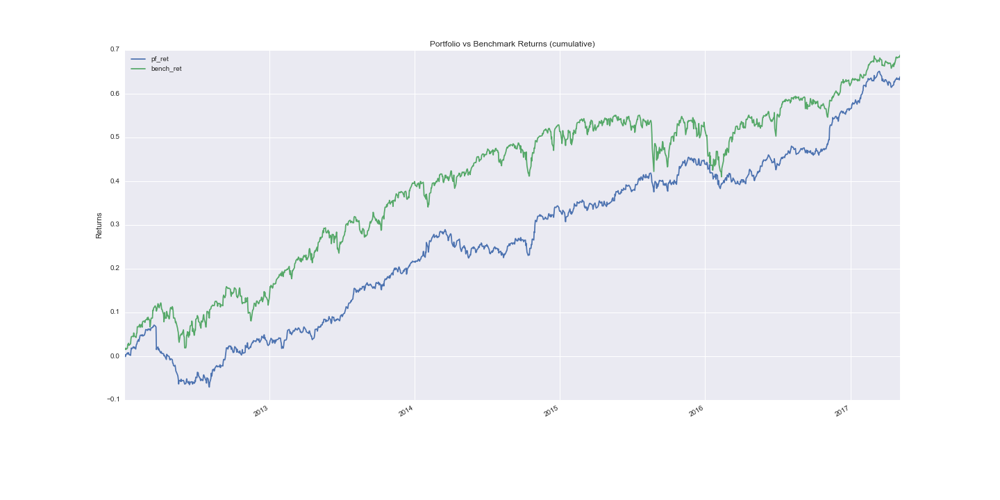
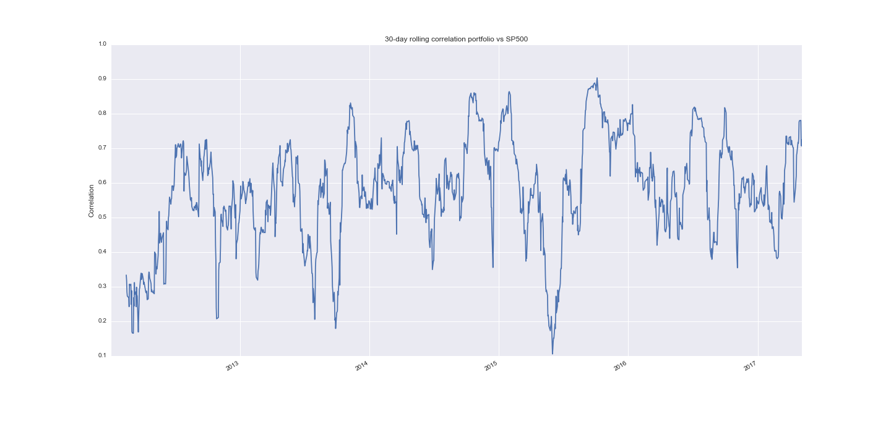
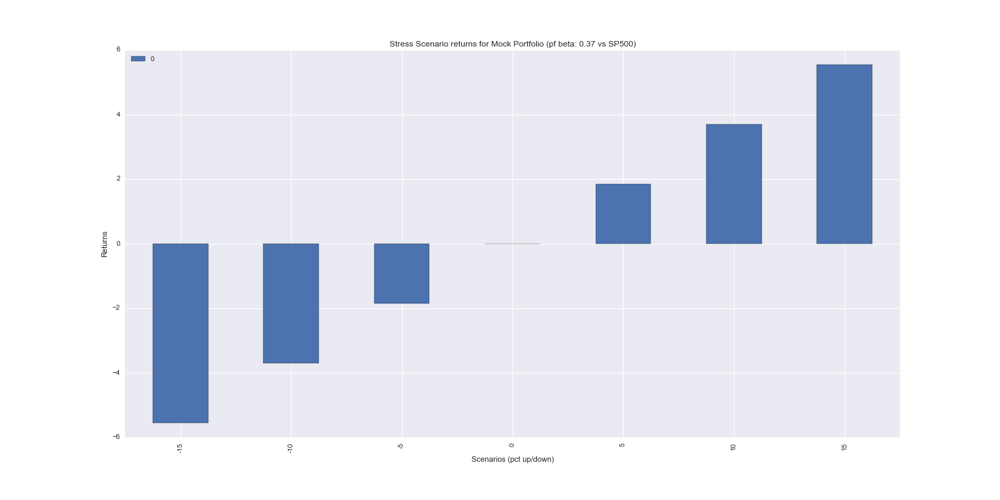

# Long Short Stress Test
Long/Short Equity Portfolio Stress Test.

This project will read the weights file for constituents (.csv), download historical prices (store them in a [SQLAlchemy Core](http://docs.sqlalchemy.org/en/latest/core/engines.html) powered db) and calculate portfolio and benchmark returns.

Once daily return series are obtained, a [portfolio beta](http://www.investopedia.com/terms/b/beta.asp) is calculated and used for stress testing.

Results are currently outputted to a styled web page.


# Dependencies:

```
Jinja2
numpy
pandas
pandas-datareader
psycopg2
SQLAlchemy
seaborn
scipy
```

Then install the remaining requirements

`pip install -r requirements.txt`

Also if it is desired to convert the html output into a pdf, you can do this using [wkhtmltopdf](https://wkhtmltopdf.org/downloads.html).


# Usage

`python run_stress_test.py --weights_file your_weights_file.csv`

Your `weights.csv` should look like this

```
ticker,weight
ticker1,0.6
ticker2,0.2
ticker3,-0.4
...
```

Here's how the visuals would look like:
 
 ##### Long Positions Breakdown
 
 
 ##### Short Positions Breakdown
 
 
 ##### Cumulative Returns
 
 
 ##### Rolling Correlations
 

 ##### Scenario Returns
 